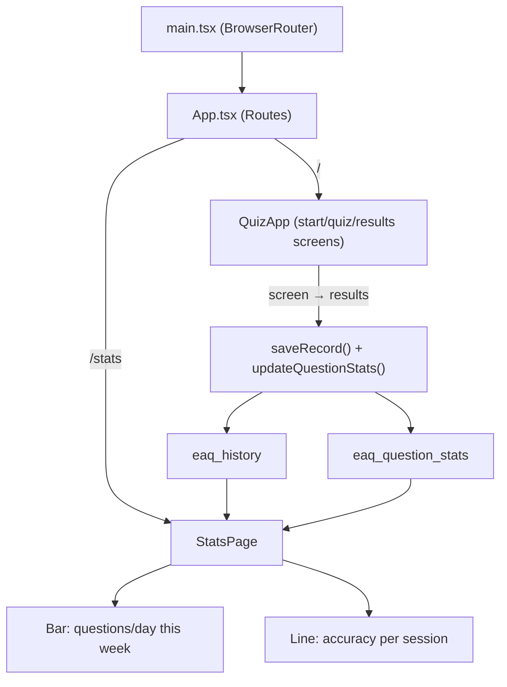

# Quiz History & Stats Page Plan

## New Dependencies

- `react-router-dom` — for the `/` and `/stats` routes
- `recharts` — for the two charts

## localStorage Data Model

### Two separate keys:

`**"eaq_history"**` — per-session records, auto-cleaned after 30 days:

```ts
interface QuizRecord {
  date: string; // ISO string
  total: number; // questions in the quiz (QUIZ_SIZE)
  correct: number; // score
}
```

`**"eaq_question_stats"**` — per-question aggregates, never expires:

```ts
interface QuestionStatsMap {
  [id: number]: { correct: number; incorrect: number };
}
```

Both are saved together when `state.screen` transitions to `'results'`.

## Files to Change / Create

### 1. `src/data/questions.ts`

Add `id: number` field to the `Question` interface and assign IDs 1–20 to each question.

### 2. `src/lib/storage.ts` (new)

- `loadHistory()` — loads + auto-prunes records older than 30 days
- `saveRecord(record)` — appends to history, wrapped in try/catch for QuotaExceededError
- `loadQuestionStats()` — loads the per-question map
- `updateQuestionStats(answers)` — increments correct/incorrect for each question answered

### 3. `src/main.tsx`

Wrap `<App />` with `<BrowserRouter>` from react-router-dom.

### 4. `src/App.tsx`

- Split into `<Routes>`: `"/"` → `<QuizApp>` (existing logic), `"/stats"` → `<StatsPage />`
- In `<QuizApp>`, add a `useRef` save-guard + `useEffect` that fires once when `state.screen === 'results'`, calling both `saveRecord` and `updateQuestionStats`
- Add a fixed "Stats" link button in the top-right corner of the page

### 5. `src/pages/StatsPage.tsx` (new)

Two Recharts charts styled to the dark slate palette:

**Chart 1 — Questions This Week (Bar Chart)**

- X-axis: Mon–Sun labels for the current week
- Y-axis: total questions answered that day
- Groups `eaq_history` records by date within the current Mon–Sun window

**Chart 2 — Quiz Accuracy Over Time (Line Chart)**

- X-axis: session number / date label
- Y-axis: accuracy % (0–100)
- Each point = one completed quiz from `eaq_history`

Also includes a "Back" button to return to `/`.

## Flow Diagram


